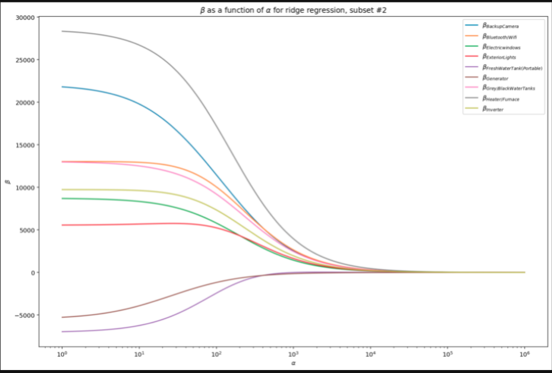

# The Price of #Vanlife 

## Motivation

Surely you have seen at least one of these rigs driving down the street of your hometown, or perhaps out on a country road somewhere: a large cargo van, with a cute couple up front, sporting enormously aggressive offroad tires, external water tanks, a ladder, solar panels and fans and a rack on the roof, and other weird and wacky gadgetry on external display. As it drives by you, you can't help but notice the fact that the back doors are covered to some significant extent in bumper stickers from a multitude of National Parks, microbreweries, various outdoor equipment suppliers, possibly a sasquatch, and something about "living the simple life". Yes, you have just seen direct evidence of Chris Farley's ironic "VAN DOWN BY THE RIVER" star-making vehicle turned into an actually-luxurious and sought-after dream vehicle for many: "van life".

I myself entered this fad in 2019, in my pre-pandemic life as a seasonal naturalist and marine protected species observer. As one who's office was often a corridor of highways linking various US National Parks, or entirely out at sea, and as a voracious world traveler, I thought that the relatively sparse amount of time I spent not working could be sensibly passed as a van dweller. Thus I came to be the owner of an older Dodge Sprinter, formerly the workhorse of a general contractor service, that I lovingly dubbed Sarabi for her new life as my home. 

I have since converted Sarabi to be a home on the road, and then realized that this lifestyle - especially post-pandemic - is not for me (full time, anyways). The time is coming for me to part ways with this ol' gal, and the journey to understanding her true market value has been windy and convoluted, to say the least. It seemed like the perfect opportunity for a pragmatic application of linear regression!

## Design and Approach

In order to gather the appropriate data for this project, I wrote a Python program to scrape targeted information from [Vanlifetrader](https://vanlifetrader.com/). This site unfortunately does not have an giant multitude of individual data points available - as of this writing (8 Nov 2021), I have just shy of 600 data points containing 55 features. Future work on this project will definitely include additional scrapings of this site as well as others, but the current time constraints of the student experience have not allowed me to expand my scraping pipeline to other sites.

Once I had my data scraped, I imported it to Pandas to begin the lengthy and oft-revisited step of EDA and **lots** of data cleaning. I was interested in three specific chunks of data from Vanlifetrader, and ended up with a substantial amount of binary features, and an approximately equal amount of categorical and numerical features. The numerical features clearly lended themselves to direct regression applications, requiring only the imputation of means to NaN values for fields like Highway MPG (based on model and fuel type) and Mileage (based on vehicle age), as well as mode imputation for fields like Wheelbase (based on model and model year). 

Categorical variables were converted to dummy variables based on sensible groupings like US region, and in the case of Drivetrain, was ordinated. After a lot of experimentation, binary features were grouped by the system ('Plumbing','Gadget', or 'Creature Comfort') that they most logically fell into, and the scores for each van in these categories were summed and then finally ordinated by "luxury category". 

All in all, my ~55ish features expanded to 78 by the time I had finished making most of it applicable to the pirposes of linear regression! That is a lot of features that don't directly lend themselves to easy regression analysis. My first model was based on features that I felt were important to determining the value of a van - it was not a good model, but did help me advance to the feature selection stage of the regression process.

## Feature Selection

I applied a variety of methods to my original models to determine which features were actually important and which were noise. I created secondary and tertiary models from various starting points by investigating p-values and variable infaltion scores at each iteration of the model. Though there were occasional jumps in r-squared accuracy, my models were constantly overfit between training and test sets as well as suffering from significant multicollinearity issues.

Due to the large number of binary features I worked with, pairplots were not very helpful in understanding relationship between features themselves, and other techniques to investigate the relationship between a binary feature and the target did not fare much better.

Exhibit A:

Exhibit B:

Eventually, I turned to visualizations of both Lasso and Ridge Regression techniques to help me create a model that struck a good balance between a robust set of significant features and simplicity.

Using Lasso Regression to select features:

Using Ridge Regression to select features:

I created figures to visualize the effect of increasing lambda on *every single feature* in my data, including the raw form of each feature as well as it's engineered version. That is 16 figures collectively! For those unfamiliar with the process of Ridge or Lasso regression, you'll see that all of the lines in the two figures above eventually converge/crash at zero, and that the point at which a given line reaches zero corresponds with a power of ten, which is what the lambda parameter has been raised to. These regression techniques weight the effect each feature through the lambda parameter in such a way that less significant features see their beta values reach zero sooner. Thus, in these figures, the most impactful features to the model will be those that sustain non-zero values the longest.

I created feature sets based on the two top-performing features from each figure, incorporated those sets into models, and saw where I had gotten. From here, I reapplied previously utilized techniques of feature elimination based on p-values to refine and simplify each model, continually seeking to reduce issues with multicollinearity, improve accuracy, and reduce overfitting issues.

## Results

I began with a sanity check by performing a linear regression on Mileage as a predictor of Sale Price. Given, campervans aren't your standard vehicle and there is a lot more than goes into their value determination than their mileage; however, it is quite normal to see that vehicles with increased milage yield lower sale prices. That is exactly what I found:

I found a similarly expected trend when I plotted model year as a predictor of sales price, although this is clearly an exponential relationship instead of a linear one:

These initial results informed me that my data was at least performing the way that I expected it to.

With these sanity checks complete, I split my data on a classic 80/20 training/test split. At this time, holding out extra data for model validation purposes would have not been feasible, due to the limited number of total data rows (~600) at my disposal. However, as I gather more data on this topic in the future, this will surely change.

After many steps back to scraping additional data and tinkering further with features, I eventually honed in on the most important features from my dataset and created a model with them. 

There are some important numbers to take note of from the above figure; some are good and some...aren't.

**The Good:**

- The difference between R^2 values in the training and test sets is slightly less than 3%, indicating that my model generalizes to out-of-sample data well and is not overfit to it's training data.

- The normalized root mean squared error is ~0.124, which isn't terribly far from zero; this provides decent evidence that this model is indeed fit pretty well.

**The Okay:**

- The R^2 value for the model on out-of-sample data is 0.715, meaning it can explain about 71.5% of the variance seen in the relationship between significant features and the ultimate selling price of a van. This isn't really that great of a predictive accuracy, but in the context of campervans where there are so many features, and where the value of a feature can take on a really big range (for example, a 'stove' in a van could be the $15 single-burner propane stove you bought on Craigslist, or it could be a $700+ induction cooktop with 2 or more burners).

**The Opportunities for Improvement:**

 - The mean absolute error is  about 17,000
 - The root mean squared error is about 21,900
 - These two figures together indicate that the model is potentially missing the actual value of a given prediction by $17,000 to $22,000, in either direction. That isn't so good for one in my shoes who is hoping to confidently sell his van for a good price!
 
## Conclusion

- Predicting the price of a campervan is a really complex task involving a **lot** of features and a lot of feature engineering
- This topic is probably still "new" enough that gathering unique, useful, and easily-parseable data is going to remain a serious hassle for a little while yet
- The features that typically predict a vehicle's value don't all apply to the case of a campervan; for instance, gas mileage has almost no effect on the ultimate price of a campervan, though for many car buyers, gas milage is a very important consideration.
- If selling within the US, *where* you sell matters! West is best.
- My model suggests that people don't care so much about everything a van is equipped with when comes to techno-gadgets, but do care how "far out" they can get into the wild and what amenities, like a hot shower, they will have out there with them.
- When it comes to vehicles converted to campervans, Mercedes-Benz Sprinters carry their value a lot farther than Dodge Promasters or Ford Transits. This really makes you think: what's in a name?

## Next Steps

- Gather a lot more data!
- Continue engineering features that have not been incorporated yet
- Explore the relationship between the "important features" and the sales price to see if they need to be transformed somehow.
- Apply a 70/20/10 split to the expanded data set in order to perform some likely much-needed validation on the model as it comes out of training.
- Explore the possibility that a linear model may not be the correct model for this sort of question!